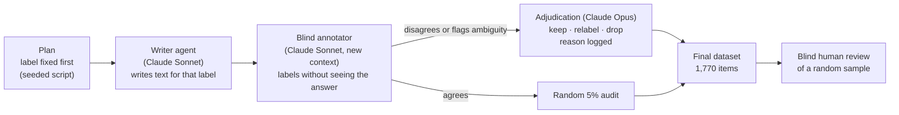

# jev-eval: an independent benchmark for TypeSafe's Jev

**Jev** is the model behind [TypeSafe](https://docs.typesafe.ai/introduction). It doesn't generate text. You send it a
piece of text and a typed question (pick an option, rate on a scale, or yes/no), and it returns a structured answer with
probabilities. TypeSafe claims Jev is strong at classification and scoring, and that its probabilities are
**calibrated**: when it says 80%, it's right about 80% of the time. The public docs don't include benchmarks for either
claim.

This repo is a small, statistically grounded benchmark to test those claims. It contains **1,770 labelled test items
across 33 tasks**, a paired comparison against **Claude Haiku 4.5**, a calibration test, and a hallucination/abstention
test.

> Not affiliated with TypeSafe or Anthropic. All texts are synthetic and use fictional people, companies and tickers.

---

## What's in the benchmark

| Family | Question type | Tasks | Items | Examples |
|---|---|---|---|---|
| **Choice** | pick one of 5–20 options | 10 | 500 | support-ticket routing, emotion, news topic, cuisine, scientific field, smart-home intent (20 options), symptom → specialty, programming language, content moderation, hotel-review aspect |
| **Score** | ordinal scale, 3–7 levels | 10 | 500 | bug severity, customer frustration, formality, technical level, politeness, urgency, answer relevance, star rating, outdoor-activity risk, hobby expertise |
| **Noul** | yes/no probability (balanced 50/50) | 10 | 500 | refund request, PII, RAG passage relevance, claim supported by source, same product, phishing, delivery problem, asks for a human, action item assigned, event already happened |
| **Stock tweets** | the same tweet asked 3 ways (5-level score, bearish/neutral/bullish, "expects a rise?") | 1 | 150 | sarcasm, trading slang, mixed signals, news relays |
| **Hallucination** | can the model say "I can't tell"? | 2 | 120 | multiple choice with a *cannot determine* option; yes/no questions the text gives no basis for (ideal answer: P ≈ 0.5) |

Every item has a difficulty tier (easy / medium / hard). Hard items are tagged with the trap they contain: distractor,
implicit cue, negation, hypothetical, sarcasm, numbers, near miss, or long irrelevant context. Jev's own docs list
these as known weak spots, so the benchmark can check whether the weaknesses show up.

## How the ground truth was built



- **Label first, text second.** The label distribution is set by design, not by the writer model. Labels are
  balanced within every task.
- **Disagreements are never dropped automatically.** Dropping them would bias the set toward "easy for an LLM" items.
  Each one is adjudicated, and the decision and its reason are logged in `data/review/decisions.jsonl`. Totals: 285
  cases reviewed, 183 kept, 25 relabelled, 77 dropped as genuinely ambiguous.
- **Audit.** A random 5% of the agreed items (92) were re-checked and 0 errors were found, which bounds the label
  error on non-adjudicated items at about 3% (95% upper bound).
- **The baseline model plays no part in building the data.** Haiku is only the comparison, so it never classifies
  its own writing.

Per-task numbers are in [`data/final/DATASET.md`](data/final/DATASET.md).

## Human validation

A human reviewer labelled a random blind sample (32 items) without seeing the ground truth:

| | Exact agreement | Within ±1 level |
|---|---|---|
| Categories and yes/no (20 items) | 18/20 (90%) | – |
| Ordinal scales (12 items) | 6/12 (50%) | 11/12 (92%) |

Of the 8 disagreements, 3 were reviewer mistakes on deliberately tricky items, confirmed on review: a Python-flavoured
bash question, a friendly-sounding phishing email, and a polite redirect that doesn't answer the question. The other 5
were all one-level differences on ordinal scales, such as "neutral" vs "formal" or "polite" vs "very polite".

**Takeaway:** on scales the exact level is inherently subjective, so the primary metric for scale tasks is accuracy
within ±1 level, with exact accuracy reported as a secondary metric. The human numbers serve as a reference ceiling.

## Statistical design (why these sizes)

- **The unit of generalization is the task.** "Jev is good at classification" is a claim about tasks, so each family
  has 10 tasks × 50 items. Confidence intervals use a two-stage cluster bootstrap (resample tasks, then items within
  tasks) and are wider than naive intervals on purpose.
- **500 items per family** give about ±4 pp on accuracy. A paired McNemar test against Haiku has about 80% power to
  detect a 5 pp difference.
- **Calibration.** ECE has a finite-sample noise floor of about 0.05 at n = 500, so instead of a bootstrap interval the
  benchmark uses a consistency-resampling test (Bröcker & Smith, 2007). Outcomes are redrawn as if Jev were perfectly
  calibrated, and the observed ECE is compared with that null distribution.
- **Hallucination.** The yes/no "no information" questions are filtered to have ~50/50 base rates. A question like
  "is the writer left-handed?" was dropped, because its honest answer is ~10%, not 50%.
- **Pre-registration.** Task specs and the analysis were frozen before the full Jev run. The only later change,
  "within ±1" as the primary scale metric, was motivated by the human review, not by Jev's results.

The analysis was validated on simulated predictors before any API call. An oracle gets accuracy 1 and ECE 0, a random
guesser gets about 1/K, and an over-confident model that says 0.95 but is right 70% of the time is flagged as
miscalibrated (p < 0.001).

## Results

🚧 **Full run pending.** A one-item-per-task smoke run against `jev-1.13.0` completed end to end: 33/33 requests,
median latency 0.28 s, and about $0.0007 in cost. That's too small to draw conclusions. The full report will be
published in `results/report.md`.

## Quickstart

```bash
git clone git@github.com:sanlares/jev-eval.git && cd jev-eval
python3 -m venv .venv && .venv/bin/pip install -r requirements.txt
echo "TYPESAFE_API_KEY=..." >> .env        # console.typesafe.ai (JET_KEY is also accepted)
echo "ANTHROPIC_API_KEY=..." >> .env       # for the Haiku baseline

.venv/bin/python run_jev.py --dry-run      # validate all payloads, no API calls
.venv/bin/python run_jev.py --smoke        # 1 item per task, ~$0.001
.venv/bin/python run_jev.py --repeat 100   # full run (~$0.02) + determinism check on 100 items
.venv/bin/python run_baseline.py           # Claude Haiku 4.5 on the same questions (~$1-2)
.venv/bin/python analyze.py                # -> results/report.md, reliability.png, risk_coverage.png
```

All runners are resumable: re-running skips items that already have an answer.

**Check the labels yourself.** Fill in the `tu_respuesta` column of `data/final/revision_humana.csv` (a blind
sample), then run `python3 build.py human-check`.

## Repository layout

```
specs.py          frozen task definitions: the exact Jev questions + generation guidance
make_plan.py      label-first item plan (seeded)
build.py          pipeline: briefs, validation, blind copies, merge/adjudication queue, final build, CSV export
run_jev.py        Jev runner (async, resumable, --smoke / --dry-run / --repeat)
run_baseline.py   Claude Haiku 4.5 baseline (forced tool call with an enum = always a valid option)
analyze.py        metrics, cluster bootstrap, McNemar, calibration test, hallucination metrics, report
data/plan|raw|blind|verify|review   every intermediate step, for full traceability
data/final/       the benchmark: *.jsonl, *.csv, DATASET.md, revision_humana.csv
LEEME.md          Spanish guide
```

## Limitations

- **Synthetic, Claude-written text.** Real inputs are messier, so treat the results as performance on clean,
  well-posed items.
- **Ceiling effect.** Ambiguous items were removed by design, and the blind annotator agreed on almost everything. If
  both models land near 95%, fine-grained differences will be hard to see. The per-trap and calibration breakdowns are
  probably more informative than headline accuracy.
- **No probabilities from Haiku.** Calibration and the "P ≈ 0.5" hallucination test are reported for Jev only.
- **Tweets measure expressed sentiment, not future returns.** Predicting returns needs real tweets and real prices.
- **English only.** Jev's docs state that English is its strongest language.
