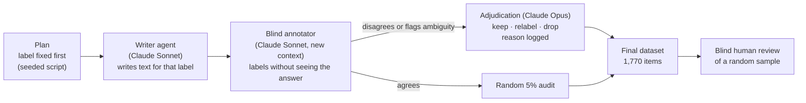
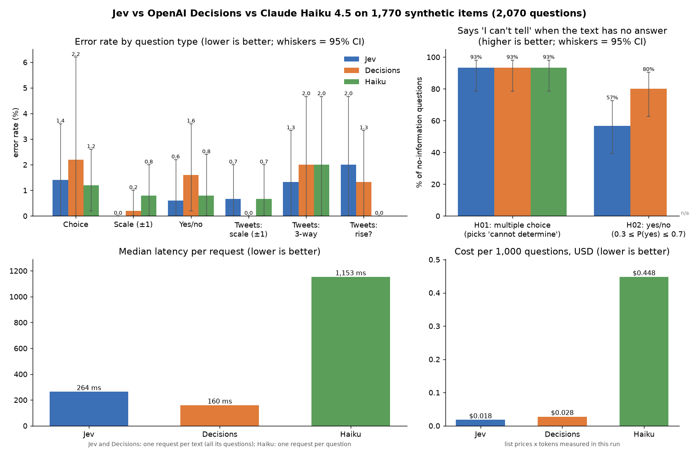

# jev-eval: an independent benchmark for "decision" models (TypeSafe's Jev and OpenAI's Decisions)

A new kind of model doesn't generate text. You send it a piece of text and typed questions (pick an option, rate on a
scale, or yes/no), and it returns structured answers with probabilities. This repo benchmarks the two main examples:

- **Jev** (`jev-1.13.0`), the model behind [TypeSafe](https://docs.typesafe.ai/introduction). TypeSafe claims it is
  strong at classification and scoring and that its probabilities are **calibrated**: when it says 80%, it's right
  about 80% of the time. The public docs don't include benchmarks for either claim.
- **OpenAI Decisions** (`gpt-6-luna`, [docs](https://developers.openai.com/api/docs/guides/decisions)), which has the
  same design: predicate, choice and score questions with probabilities, and answers about 10x faster than the
  Responses API, per OpenAI.

Both are compared with each other and with a general LLM baseline, **Claude Haiku 4.5**, on **1,770 labelled test items
across 33 tasks**. The benchmark covers accuracy, a calibration test, a hallucination/abstention test, consistency,
determinism, latency and cost.

> Not affiliated with TypeSafe, OpenAI or Anthropic. All texts are synthetic and use fictional people, companies and
> tickers.

---

## What's in the benchmark

| Family | Question type | Tasks | Items | Examples |
|---|---|---|---|---|
| **Choice** | pick one of 5–20 options | 10 | 500 | support-ticket routing, emotion, news topic, cuisine, scientific field, smart-home intent (20 options), symptom → specialty, programming language, content moderation, hotel-review aspect |
| **Score** | ordinal scale, 3–7 levels | 10 | 500 | bug severity, customer frustration, formality, technical level, politeness, urgency, answer relevance, star rating, outdoor-activity risk, hobby expertise |
| **Noul** | yes/no probability (balanced 50/50) | 10 | 500 | refund request, PII, RAG passage relevance, claim supported by source, same product, phishing, delivery problem, asks for a human, action item assigned, event already happened |
| **Stock tweets** | the same tweet asked 3 ways (5-level score, bearish/neutral/bullish, "expects a rise?") | 1 | 150 | sarcasm, trading slang, mixed signals, news relays |
| **Hallucination** | can the model say "I can't tell"? | 2 | 120 | multiple choice with a *cannot determine* option; yes/no questions the text gives no basis for (ideal answer: P ≈ 0.5) |

Every item has a difficulty tier (easy / medium / hard). Hard items are tagged with the trap they contain: distractor,
implicit cue, negation, hypothetical, sarcasm, numbers, near miss, or long irrelevant context. Jev's own docs list
these as known weak spots, so the benchmark can check whether the weaknesses show up.

## How the ground truth was built



- **Label first, text second.** The label distribution is set by design, not by the writer model. Labels are
  balanced within every task.
- **Disagreements are never dropped automatically.** Dropping them would bias the set toward "easy for an LLM" items.
  Each one is adjudicated, and the decision and its reason are logged in `data/review/decisions.jsonl`. Totals: 285
  cases reviewed, 183 kept, 25 relabelled, 77 dropped as genuinely ambiguous.
- **Audit.** A random 5% of the agreed items (92) were re-checked and 0 errors were found, which bounds the label
  error on non-adjudicated items at about 3% (95% upper bound).
- **The baseline model plays no part in building the data.** Haiku is only the comparison, so it never classifies
  its own writing.

Per-task numbers are in [`data/final/DATASET.md`](data/final/DATASET.md).

## Human validation

A human reviewer labelled a random blind sample (32 items) without seeing the ground truth:

| | Exact agreement | Within ±1 level |
|---|---|---|
| Categories and yes/no (20 items) | 18/20 (90%) | – |
| Ordinal scales (12 items) | 6/12 (50%) | 11/12 (92%) |

Of the 8 disagreements, 3 were reviewer mistakes on deliberately tricky items, confirmed on review: a Python-flavoured
bash question, a friendly-sounding phishing email, and a polite redirect that doesn't answer the question. The other 5
were all one-level differences on ordinal scales, such as "neutral" vs "formal" or "polite" vs "very polite".

**Takeaway:** on scales the exact level is inherently subjective, so the primary metric for scale tasks is accuracy
within ±1 level, with exact accuracy reported as a secondary metric. The human numbers serve as a reference ceiling.

## Statistical design (why these sizes)

- **The unit of generalization is the task.** "Jev is good at classification" is a claim about tasks, so each family
  has 10 tasks × 50 items. Confidence intervals use a two-stage cluster bootstrap (resample tasks, then items within
  tasks) and are wider than naive intervals on purpose.
- **500 items per family** give about ±4 pp on accuracy. A paired McNemar test against Haiku has about 80% power to
  detect a 5 pp difference.
- **Calibration.** ECE has a finite-sample noise floor of about 0.05 at n = 500, so instead of a bootstrap interval the
  benchmark uses a consistency-resampling test (Bröcker & Smith, 2007). Outcomes are redrawn as if Jev were perfectly
  calibrated, and the observed ECE is compared with that null distribution.
- **Hallucination.** The yes/no "no information" questions are filtered to have ~50/50 base rates. A question like
  "is the writer left-handed?" was dropped, because its honest answer is ~10%, not 50%.
- **Pre-registration.** Task specs and the analysis were frozen before the full Jev run. The only later change,
  "within ±1" as the primary scale metric, was motivated by the human review, not by Jev's results.

The analysis was validated on simulated predictors before any API call. An oracle gets accuracy 1 and ECE 0, a random
guesser gets about 1/K, and an over-confident model that says 0.95 but is right 70% of the time is flagged as
miscalibrated (p < 0.001).

## Fair comparison: format, latency, cost

- **Same questions, same information.** Each Jev question is translated 1:1 to the Decisions API: choice → `choices`
  with value and description; score → `levels` with label and description; yes/no → `predicate`. Predicates have no
  criteria field, so the yes/no criteria are appended to the instructions. JSON inputs are sent as text, since Decisions
  only accepts text or messages. All questions about an item go in one request, as with Jev. Answers are stored raw
  and in a normalized shape shared with Jev, so both go through exactly the same analysis. A refusal counts as wrong.
- **Guaranteed format for the LLM baseline.** Haiku gets the exact instructions and options Jev gets. Its reply is
  constrained with structured outputs (`output_config.format`, a JSON Schema whose `enum` lists the valid options), so
  it can only answer with a valid label of the right type: integer level, boolean, or option key. Every reply is still
  parsed and validated, and anything unexpected (refusal, truncation) is stored as invalid rather than silently dropped.
- **Isolation.** Jev and Decisions evaluate the questions of a request independently. To match that, Haiku answers each
  question in its own call, so the three questions about a tweet never see each other's answers.
- **Latency.** Each request records the latency of the successful attempt only. Both runners turn off their SDK's
  automatic retries and use their own retry loop, so rate-limit back-offs never inflate the timing, and the number of
  attempts is logged. Jev and Decisions answer all questions of an item in one request; Haiku makes one request per
  question.
- **Cost.** Each request logs its input and output tokens. The report shows total cost and cost per 1,000 questions
  (Jev: $0.042 per million input tokens, output free; Decisions: $0.10 per million input tokens, output free; Haiku 4.5:
  $1 per million input, $5 per million output).

## Results



Full runs on all 1,770 items: 2,070 questions, 2,040 of them with a known correct answer (the 30 "no information"
questions are scored separately). No failed requests, refusals or invalid answers for any model.

| | Jev | OpenAI Decisions | Claude Haiku 4.5 |
|---|---|---|---|
| Accuracy: choice (500) | 98.6% | 97.8% | 98.8% |
| Accuracy: scales, within ±1 level (500) | 100% | 99.8% | 99.2% |
| Accuracy: yes/no (500) | 99.4% | 98.4% | 99.2% |
| Accuracy: stock tweets, 3 formats (450) | 98.7% | 98.9% | 99.1% |
| Total errors (of 2,040) | 18 | 28 | 20 |
| Probabilities calibrated (of 6 question types) | 4 | 4 | n/a |
| Says "I can't tell" when the text has no answer: multiple choice / yes-no | 93% / 57% | 93% / 80% | 93% / n/a |
| Same answer when asked twice (100 items) | 100% | 100% | not tested |
| Median latency per request | 264 ms | 160 ms | 1,153 ms |
| Cost per 1,000 questions | $0.018 | $0.028 | $0.45 |

**What the numbers say**

- **Accuracy is a tie.** All three models land at 98–100% on every question type, and no pairwise difference is
  statistically significant. On clean, well-posed items, a general LLM with constrained output classifies as well as
  either decision model. This is the ceiling effect the design anticipated.
- **Speed and cost are not a tie.** Decisions is the fastest (160 ms median per request) and Jev the cheapest
  ($0.018 per 1,000 questions). Haiku is 4–7x slower and 16–25x more expensive, partly because it needs one
  request per question.
- **Calibration mostly holds, with exceptions.** Jev's probabilities pass the calibration test on choice, scales and
  two tweet formats, but not on yes/no questions or "expects a rise?". Decisions fails on scales and yes/no. Errors
  happen rarely, but when a model is wrong it is sometimes wrong with 95–100% confidence.
- **"Not mentioned" is not "no".** When the text gives no basis for a yes/no answer, Decisions usually answers close
  to 0.5 (80% of cases; exactly 0.50 on 20 of 30). Jev leans towards "no" (mean P(yes) 0.35).
- **Each model fails in its own way** (all in [`results/cases.md`](results/cases.md)):
  - All three accept kg and pound weights that don't match as "the same product", with 92–98% confidence.
  - Decisions reads disgust as anger in 4 texts, and says a cancelled race and a half-built bridge already happened
    with 97–100% confidence.
  - Jev reads options slang ("the put wall is getting torn through… bought my first calls") as bearish in all three
    formats of the same tweet.
  - Jev and Decisions take a sarcastic tone as a bearish signal.
  - Haiku underrates experts and routes SSO login problems to `bug_report`.
- **Some errors are the benchmark's.** 9 of the failing items have a debatable label (too few cues, two emotions at
  once, news that can be read as mildly negative). They are marked as such.

**Read more**

- [`results/report.md`](results/report.md): every statistic, with confidence intervals, plus breakdowns by
  difficulty, trap type, length, number of options and task, reliability diagrams and determinism.
- [`results/cases.md`](results/cases.md): every question that at least one model gets wrong, written out in full
  (text, question, options, correct answer, each model's answer and confidence) with a verdict, plus hard items all
  three get right.
- [`results/item_level.csv`](results/item_level.csv): one row per question with every model's answer, for your own
  analysis. Raw responses are in `results/{jev,decisions,haiku}/responses.jsonl`.

## Quickstart

```bash
git clone git@github.com:sanlares/jev-eval.git && cd jev-eval
python3 -m venv .venv && .venv/bin/pip install -r requirements.txt
echo "TYPESAFE_API_KEY=..." >> .env        # console.typesafe.ai (JET_KEY is also accepted)
echo "OPENAI_API_KEY=..." >> .env          # for OpenAI Decisions
echo "ANTHROPIC_API_KEY=..." >> .env       # for the Haiku baseline

.venv/bin/python run_jev.py --dry-run      # validate all payloads, no API calls
.venv/bin/python run_jev.py --smoke        # 1 item per task, ~$0.001
.venv/bin/python run_jev.py --repeat 100   # full run (~$0.04) + determinism check on 100 items
.venv/bin/python run_decisions.py --smoke  # 1 item per task, ~$0.001
.venv/bin/python run_decisions.py --repeat 100   # full run (~$0.06) + determinism check
.venv/bin/python run_baseline.py --smoke   # 1 item per task, ~$0.02
.venv/bin/python run_baseline.py           # Claude Haiku 4.5 on the same questions (~$1)
.venv/bin/python analyze.py                # -> results/report.md, summary.png, reliability.png, risk_coverage.png
.venv/bin/python make_cases.py             # -> results/cases.md (every failing question in full)
```

All runners are resumable: re-running skips items that already have an answer.

**Check the labels yourself.** Fill in the `tu_respuesta` ("your answer") column of `data/final/revision_humana.csv` (a blind
sample), then run `python3 build.py human-check`.

## Repository layout

```
specs.py          frozen task definitions: the exact Jev questions + generation guidance
make_plan.py      label-first item plan (seeded)
build.py          pipeline: briefs, validation, blind copies, merge/adjudication queue, final build, CSV export
run_jev.py        Jev runner (async, resumable, --smoke / --dry-run / --repeat)
run_decisions.py  OpenAI Decisions runner (same protocol as run_jev.py; Jev questions translated 1:1)
run_baseline.py   Claude Haiku 4.5 baseline (structured outputs with an enum = always a valid option)
analyze.py        all models: metrics, cluster bootstrap, pairwise McNemar, calibration test, hallucination,
                  consistency, determinism, latency and cost, report and figures
make_cases.py     results/cases.md: every failing question in full, with a verdict
data/plan|raw|blind|verify|review   every intermediate step, for full traceability
data/final/       the benchmark: *.jsonl, *.csv, DATASET.md, revision_humana.csv
results/          raw responses per model, report.md, cases.md, item_level.csv, figures
```

## Limitations

- **Synthetic, Claude-written text.** Real inputs are messier, so treat the results as performance on clean,
  well-posed items.
- **Ceiling effect.** Ambiguous items were removed by design, and the blind annotator agreed on almost everything. All
  three models land at 98–100%, so the benchmark cannot rank them on accuracy. A harder or messier set would be needed
  for that; the calibration, abstention and error-pattern results are more informative than headline accuracy.
- **No probabilities from Haiku.** Calibration and the "P ≈ 0.5" hallucination test are reported for Jev and Decisions
  only.
- **Prompts were written in Jev's format.** The task specs follow TypeSafe's guidance, and the Decisions questions are
  a faithful translation of them. If anything, this format could slightly favour Jev.
- **Tweets measure expressed sentiment, not future returns.** Predicting returns needs real tweets and real prices.
- **English only.** Jev's docs state that English is its strongest language.
- **Decisions is in public beta.** Results reflect `gpt-6-luna` at the time of the run (October 2026).
- **Jev's latency was timed before the retry-free timer was added.** A request's time may include automatic SDK
  retries, and attempts were not logged. The median is robust to this, but Jev's p99 may be slightly inflated.
