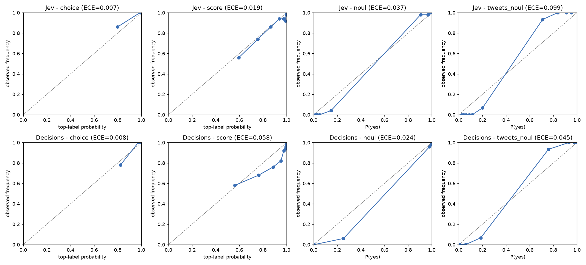
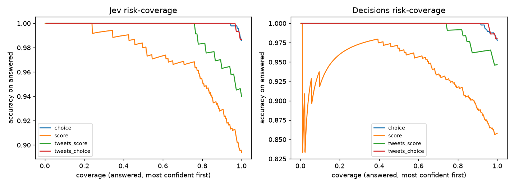

# Benchmark report: Jev vs OpenAI Decisions vs Claude Haiku 4.5

Models: Jev (`jev-1.13.0`), Decisions (`gpt-6-luna (OpenAI Decisions)`), Haiku (`claude-haiku-4-5`) | items: 1770 | questions: 2070


## Plain-language summary

Accuracy = share of correct answers, with its 95% confidence interval in brackets (cluster bootstrap over tasks). On scales, landing within ±1 level of the correct level counts as correct; the exact level is in the detailed metrics below. A refusal or an invalid answer counts as wrong.

### Accuracy per model
| question type      | counts as correct   | Jev                  | Decisions            | Haiku                |
|:-------------------|:--------------------|:---------------------|:---------------------|:---------------------|
| Choice             | exact answer        | 0.986 [0.964, 1.000] | 0.978 [0.938, 1.000] | 0.988 [0.974, 0.998] |
| Scale (±1)         | within ±1 level     | 1.000 [1.000, 1.000] | 0.998 [0.990, 1.000] | 0.992 [0.980, 1.000] |
| Yes/no             | exact answer        | 0.994 [0.978, 1.000] | 0.984 [0.964, 0.998] | 0.992 [0.976, 1.000] |
| Tweets: scale (±1) | within ±1 level     | 0.993 [0.980, 1.000] | 1.000 [1.000, 1.000] | 0.993 [0.980, 1.000] |
| Tweets: 3-way      | exact answer        | 0.987 [0.967, 1.000] | 0.980 [0.953, 1.000] | 0.980 [0.953, 1.000] |
| Tweets: rise?      | exact answer        | 0.980 [0.953, 1.000] | 0.987 [0.967, 1.000] | 1.000 [1.000, 1.000] |

### Which model is better? (paired differences: both models answered the same items)
| question type      | Jev - Decisions                     | Jev - Haiku                         | Decisions - Haiku                   |
|:-------------------|:------------------------------------|:------------------------------------|:------------------------------------|
| Choice             | no significant difference (+0.8 pp) | no significant difference (-0.2 pp) | no significant difference (-1.0 pp) |
| Scale (±1)         | no significant difference (+0.2 pp) | no significant difference (+0.8 pp) | no significant difference (+0.6 pp) |
| Yes/no             | no significant difference (+1.0 pp) | no significant difference (+0.2 pp) | no significant difference (-0.8 pp) |
| Tweets: scale (±1) | no significant difference (-0.7 pp) | no significant difference (+0.0 pp) | no significant difference (+0.7 pp) |
| Tweets: 3-way      | no significant difference (+0.7 pp) | no significant difference (+0.7 pp) | no significant difference (+0.0 pp) |
| Tweets: rise?      | no significant difference (-0.7 pp) | no significant difference (-2.0 pp) | no significant difference (-1.3 pp) |

### Are the probabilities calibrated? (only models that return probabilities)
'yes' = no miscalibration detected beyond sampling noise; 'no (p<0.05)' = the model is systematically over- or under-confident.

| question type      | Jev                    | Decisions              |
|:-------------------|:-----------------------|:-----------------------|
| Choice             | yes, ECE 0.007         | yes, ECE 0.008         |
| Scale (±1)         | yes, ECE 0.019         | no (p<0.05), ECE 0.058 |
| Yes/no             | no (p<0.05), ECE 0.037 | no (p<0.05), ECE 0.024 |
| Tweets: scale (±1) | yes, ECE 0.020         | yes, ECE 0.074         |
| Tweets: 3-way      | yes, ECE 0.021         | yes, ECE 0.012         |
| Tweets: rise?      | no (p<0.05), ECE 0.099 | yes, ECE 0.045         |

### Human reference (blind review of a random sample)
| type                  |   items reviewed | exact agreement   | within ±1 level   |
|:----------------------|-----------------:|:------------------|:------------------|
| categories and yes/no |               20 | 90% [70-97]       | -                 |
| ordinal scales        |               12 | 50% [25-75]       | 92% [65-99]       |

### Speed and cost
Latency = the successful attempt only (back-offs after rate limits are excluded). Jev and Decisions answer all questions about an item in one request (3 for tweets); Haiku makes one request per question. Runs are concurrent and depend on the network: compare medians, not single values. Jev: this run predates the retry-free timer, so a request's latency may include automatic SDK retries (the median is robust to this; p99 may not be).

| model     |   requests |   questions |   median latency (ms) |   p90 (ms) |   p99 (ms) | requests retried   |   total cost (USD) |   cost per 1,000 questions (USD) |
|:----------|-----------:|------------:|----------------------:|-----------:|-----------:|:-------------------|-------------------:|---------------------------------:|
| Jev       |       1770 |        2070 |                   264 |        355 |        533 | not logged         |             0.037  |                           0.0179 |
| Decisions |       1770 |        2070 |                   160 |        313 |       1341 | 0                  |             0.0574 |                           0.0277 |
| Haiku     |       2040 |        2040 |                  1153 |       1300 |       2394 | 0                  |             0.9134 |                           0.4478 |

### Hallucination: does the model admit when the text doesn't contain the answer?
Haiku returns no probabilities, hence 'n/a' for the H02 no-information rows.

| measurement                                                                                | Jev           | Decisions     | Haiku         |
|:-------------------------------------------------------------------------------------------|:--------------|:--------------|:--------------|
| H01: picks 'cannot determine' when the text does NOT contain the answer (higher is better) | 93% [79-98]   | 93% [79-98]   | 93% [79-98]   |
| H01: picks 'cannot determine' when the text DOES contain the answer (lower is better)      | 0% [0-11]     | 3% [1-17]     | 0% [0-11]     |
| H01: picks the right option when the text contains the answer (higher is better)           | 100% [89-100] | 97% [83-99]   | 100% [89-100] |
| H02 no information: mean P(yes) (ideal 0.50)                                               | 0.35          | 0.44          | n/a           |
| H02 no information: says 'I can't tell', 0.3 <= P <= 0.7 (higher is better)                | 57% [39-73]   | 80% [63-90]   | n/a           |
| H02 no information: confident answer, P < 0.2 or P > 0.8 (lower is better)                 | 23% [12-41]   | 17% [7-34]    | n/a           |
| H02 answerable controls: correct (higher is better)                                        | 100% [89-100] | 100% [89-100] | 100% [89-100] |

## Primary metrics per model (95% cluster-bootstrap CI; clusters = tasks)
| family        | model     | metric           |   n | accuracy             | calibration ECE               | exact level          | brier                |
|:--------------|:----------|:-----------------|----:|:---------------------|:------------------------------|:---------------------|:---------------------|
| choice        | Jev       | exact            | 500 | 0.986 [0.964, 1.000] | 0.007 (null95 0.011, p=0.235) | nan                  | nan                  |
| choice        | Decisions | exact            | 500 | 0.978 [0.938, 1.000] | 0.008 (null95 0.013, p=0.392) | nan                  | nan                  |
| choice        | Haiku     | exact            | 500 | 0.988 [0.974, 0.998] | nan                           | nan                  | nan                  |
| score         | Jev       | within +-1 level | 500 | 1.000 [1.000, 1.000] | 0.019 (null95 0.032, p=0.569) | 0.894 [0.840, 0.940] | nan                  |
| score         | Decisions | within +-1 level | 500 | 0.998 [0.990, 1.000] | 0.058 (null95 0.032, p=0.000) | 0.858 [0.808, 0.906] | nan                  |
| score         | Haiku     | within +-1 level | 500 | 0.992 [0.980, 1.000] | nan                           | 0.874 [0.812, 0.928] | nan                  |
| noul          | Jev       | exact            | 500 | 0.994 [0.978, 1.000] | 0.037 (null95 0.030, p=0.006) | nan                  | 0.009 [0.002, 0.020] |
| noul          | Decisions | exact            | 500 | 0.984 [0.964, 0.998] | 0.024 (null95 0.012, p=0.000) | nan                  | 0.014 [0.002, 0.030] |
| noul          | Haiku     | exact            | 500 | 0.992 [0.976, 1.000] | nan                           | nan                  | nan                  |
| tweets_score  | Jev       | within +-1 level | 150 | 0.993 [0.980, 1.000] | 0.020 (null95 0.056, p=0.912) | 0.940 [0.900, 0.973] | nan                  |
| tweets_score  | Decisions | within +-1 level | 150 | 1.000 [1.000, 1.000] | 0.074 (null95 0.077, p=0.077) | 0.947 [0.907, 0.980] | nan                  |
| tweets_score  | Haiku     | within +-1 level | 150 | 0.993 [0.980, 1.000] | nan                           | 0.920 [0.873, 0.960] | nan                  |
| tweets_choice | Jev       | exact            | 150 | 0.987 [0.967, 1.000] | 0.021 (null95 0.029, p=0.264) | nan                  | nan                  |
| tweets_choice | Decisions | exact            | 150 | 0.980 [0.953, 1.000] | 0.012 (null95 0.031, p=0.679) | nan                  | nan                  |
| tweets_choice | Haiku     | exact            | 150 | 0.980 [0.953, 1.000] | nan                           | nan                  | nan                  |
| tweets_noul   | Jev       | exact            | 150 | 0.980 [0.953, 1.000] | 0.099 (null95 0.086, p=0.011) | nan                  | 0.022 [0.016, 0.031] |
| tweets_noul   | Decisions | exact            | 150 | 0.987 [0.967, 1.000] | 0.045 (null95 0.050, p=0.110) | nan                  | 0.014 [0.008, 0.022] |
| tweets_noul   | Haiku     | exact            | 150 | 1.000 [1.000, 1.000] | nan                           | nan                  | nan                  |

## Pairwise comparisons (difference = first minus second model)
| family        | comparison        |   n paired | difference             | mcnemar                                  |
|:--------------|:------------------|-----------:|:-----------------------|:-----------------------------------------|
| choice        | Jev - Decisions   |        500 | 0.008 [-0.010, 0.036]  | Jev-only=6, Decisions-only=2, p=0.2891   |
| choice        | Jev - Haiku       |        500 | -0.002 [-0.022, 0.016] | Jev-only=4, Haiku-only=5, p=1.0000       |
| choice        | Decisions - Haiku |        500 | -0.010 [-0.048, 0.014] | Decisions-only=4, Haiku-only=9, p=0.2668 |
| score         | Jev - Decisions   |        500 | 0.002 [0.000, 0.010]   | Jev-only=1, Decisions-only=0, p=1.0000   |
| score         | Jev - Haiku       |        500 | 0.008 [0.000, 0.020]   | Jev-only=4, Haiku-only=0, p=0.1250       |
| score         | Decisions - Haiku |        500 | 0.006 [0.000, 0.018]   | Decisions-only=3, Haiku-only=0, p=0.2500 |
| noul          | Jev - Decisions   |        500 | 0.010 [-0.004, 0.030]  | Jev-only=6, Decisions-only=1, p=0.1250   |
| noul          | Jev - Haiku       |        500 | 0.002 [-0.006, 0.010]  | Jev-only=2, Haiku-only=1, p=1.0000       |
| noul          | Decisions - Haiku |        500 | -0.008 [-0.030, 0.008] | Decisions-only=2, Haiku-only=6, p=0.2891 |
| tweets_score  | Jev - Decisions   |        150 | -0.007 [-0.020, 0.000] | Jev-only=0, Decisions-only=1, p=1.0000   |
| tweets_score  | Jev - Haiku       |        150 | 0.000 [-0.020, 0.020]  | Jev-only=1, Haiku-only=1, p=1.0000       |
| tweets_score  | Decisions - Haiku |        150 | 0.007 [0.000, 0.020]   | Decisions-only=1, Haiku-only=0, p=1.0000 |
| tweets_choice | Jev - Decisions   |        150 | 0.007 [-0.013, 0.027]  | Jev-only=2, Decisions-only=1, p=1.0000   |
| tweets_choice | Jev - Haiku       |        150 | 0.007 [-0.027, 0.033]  | Jev-only=3, Haiku-only=2, p=1.0000       |
| tweets_choice | Decisions - Haiku |        150 | 0.000 [-0.033, 0.033]  | Decisions-only=3, Haiku-only=3, p=1.0000 |
| tweets_noul   | Jev - Decisions   |        150 | -0.007 [-0.027, 0.013] | Jev-only=1, Decisions-only=2, p=1.0000   |
| tweets_noul   | Jev - Haiku       |        150 | -0.020 [-0.047, 0.000] | Jev-only=0, Haiku-only=3, p=0.2500       |
| tweets_noul   | Decisions - Haiku |        150 | -0.013 [-0.033, 0.000] | Decisions-only=0, Haiku-only=2, p=0.5000 |

## All metrics per family and model (point estimates)
| family        | model     |   n |   acc_exact |   no_answer |   macro_f1 |   ece_top |   brier |   within1 |     qwk |   mae_norm |     rps |   auroc |   logloss |     ece |
|:--------------|:----------|----:|------------:|------------:|-----------:|----------:|--------:|----------:|--------:|-----------:|--------:|--------:|----------:|--------:|
| choice        | Jev       | 500 |       0.986 |           0 |      0.986 |     0.007 |   0.022 |   nan     | nan     |    nan     | nan     | nan     |   nan     | nan     |
| choice        | Decisions | 500 |       0.978 |           0 |      0.977 |     0.008 |   0.033 |   nan     | nan     |    nan     | nan     | nan     |   nan     | nan     |
| choice        | Haiku     | 500 |       0.988 |           0 |      0.988 |   nan     | nan     |   nan     | nan     |    nan     | nan     | nan     |   nan     | nan     |
| score         | Jev       | 500 |       0.894 |           0 |    nan     |     0.019 |   0.155 |     1     |   0.969 |      0.037 |   0.021 | nan     |   nan     | nan     |
| score         | Decisions | 500 |       0.858 |           0 |    nan     |     0.058 |   0.219 |     0.998 |   0.947 |      0.049 |   0.033 | nan     |   nan     | nan     |
| score         | Haiku     | 500 |       0.874 |           0 |    nan     |   nan     | nan     |     0.992 |   0.955 |    nan     | nan     | nan     |   nan     | nan     |
| noul          | Jev       | 500 |       0.994 |           0 |    nan     |   nan     |   0.009 |   nan     | nan     |    nan     | nan     |   0.998 |     0.06  |   0.037 |
| noul          | Decisions | 500 |       0.984 |           0 |    nan     |   nan     |   0.014 |   nan     | nan     |    nan     | nan     |   0.997 |     0.074 |   0.024 |
| noul          | Haiku     | 500 |       0.992 |           0 |    nan     |   nan     | nan     |   nan     | nan     |    nan     | nan     | nan     |   nan     | nan     |
| tweets_score  | Jev       | 150 |       0.94  |           0 |    nan     |     0.02  |   0.089 |     0.993 |   0.961 |      0.03  |   0.014 | nan     |   nan     | nan     |
| tweets_score  | Decisions | 150 |       0.947 |           0 |    nan     |     0.074 |   0.098 |     1     |   0.987 |      0.036 |   0.013 | nan     |   nan     | nan     |
| tweets_score  | Haiku     | 150 |       0.92  |           0 |    nan     |   nan     | nan     |     0.993 |   0.976 |    nan     | nan     | nan     |   nan     | nan     |
| tweets_choice | Jev       | 150 |       0.987 |           0 |      0.986 |     0.021 |   0.024 |   nan     | nan     |    nan     | nan     | nan     |   nan     | nan     |
| tweets_choice | Decisions | 150 |       0.98  |           0 |      0.974 |     0.012 |   0.029 |   nan     | nan     |    nan     | nan     | nan     |   nan     | nan     |
| tweets_choice | Haiku     | 150 |       0.98  |           0 |      0.976 |   nan     | nan     |   nan     | nan     |    nan     | nan     | nan     |   nan     | nan     |
| tweets_noul   | Jev       | 150 |       0.98  |           0 |    nan     |   nan     |   0.022 |   nan     | nan     |    nan     | nan     |   1     |     0.129 |   0.099 |
| tweets_noul   | Decisions | 150 |       0.987 |           0 |    nan     |   nan     |   0.014 |   nan     | nan     |    nan     | nan     |   1     |     0.07  |   0.045 |
| tweets_noul   | Haiku     | 150 |       1     |           0 |    nan     |   nan     | nan     |   nan     | nan     |    nan     | nan     | nan     |   nan     | nan     |

## By difficulty
| family        | difficulty   |   n |      Jev |   Decisions |    Haiku |
|:--------------|:-------------|----:|---------:|------------:|---------:|
| choice        | easy         | 145 | 0.993103 |    1        | 1        |
| choice        | hard         | 158 | 0.993671 |    0.974684 | 0.974684 |
| choice        | medium       | 197 | 0.974619 |    0.964467 | 0.989848 |
| halluc_choice | easy         |  20 | 1        |    1        | 0.95     |
| halluc_choice | hard         |  17 | 0.941176 |    0.882353 | 0.941176 |
| halluc_choice | medium       |  23 | 0.956522 |    0.956522 | 1        |
| halluc_noul   | easy         |   9 | 1        |    1        | 1        |
| halluc_noul   | hard         |   8 | 1        |    1        | 1        |
| halluc_noul   | medium       |  13 | 1        |    1        | 1        |
| noul          | easy         | 153 | 1        |    0.993464 | 1        |
| noul          | hard         | 142 | 0.978873 |    0.978873 | 0.978873 |
| noul          | medium       | 205 | 1        |    0.980488 | 0.995122 |
| score         | easy         | 152 | 0.901316 |    0.881579 | 0.907895 |
| score         | hard         | 135 | 0.925926 |    0.844444 | 0.837037 |
| score         | medium       | 213 | 0.868545 |    0.849765 | 0.873239 |
| tweets_choice | easy         |  45 | 1        |    1        | 1        |
| tweets_choice | hard         |  43 | 0.953488 |    0.953488 | 0.953488 |
| tweets_choice | medium       |  62 | 1        |    0.983871 | 0.983871 |
| tweets_noul   | easy         |  45 | 1        |    1        | 1        |
| tweets_noul   | hard         |  43 | 0.976744 |    0.976744 | 1        |
| tweets_noul   | medium       |  62 | 0.967742 |    0.983871 | 1        |
| tweets_score  | easy         |  45 | 1        |    0.955556 | 0.933333 |
| tweets_score  | hard         |  43 | 0.930233 |    0.930233 | 0.883721 |
| tweets_score  | medium       |  62 | 0.903226 |    0.951613 | 0.935484 |

## By hard type
| family        | hard_type           |   n |      Jev |   Decisions |    Haiku |
|:--------------|:--------------------|----:|---------:|------------:|---------:|
| choice        | -                   | 342 | 0.982456 |    0.979532 | 0.994152 |
| choice        | distractor          |  47 | 1        |    0.978723 | 0.978723 |
| choice        | implicit            |  49 | 1        |    0.979592 | 0.979592 |
| choice        | long_irrelevant     |  33 | 1        |    1        | 1        |
| choice        | near_miss           |   5 | 1        |    1        | 1        |
| choice        | negation            |   6 | 1        |    1        | 0.833333 |
| choice        | sarcasm             |  18 | 0.944444 |    0.888889 | 0.944444 |
| halluc_choice | -                   |  43 | 0.976744 |    0.976744 | 0.976744 |
| halluc_choice | implicit            |   9 | 1        |    0.888889 | 1        |
| halluc_choice | related_but_missing |   4 | 1        |    1        | 1        |
| halluc_choice | tempting_guess      |   4 | 0.75     |    0.75     | 0.75     |
| halluc_noul   | -                   |  22 | 1        |    1        | 1        |
| halluc_noul   | implicit            |   8 | 1        |    1        | 1        |
| noul          | -                   | 358 | 1        |    0.986034 | 0.997207 |
| noul          | distractor          |   9 | 1        |    1        | 1        |
| noul          | hypothetical        |   8 | 1        |    1        | 1        |
| noul          | implicit            |  29 | 0.931034 |    0.931034 | 0.896552 |
| noul          | long_irrelevant     |  11 | 1        |    1        | 1        |
| noul          | near_miss           |  30 | 1        |    0.966667 | 1        |
| noul          | negation            |  28 | 1        |    1        | 1        |
| noul          | numbers             |  17 | 0.941176 |    1        | 1        |
| noul          | quoted              |  10 | 1        |    1        | 1        |
| score         | -                   | 365 | 0.882192 |    0.863014 | 0.887671 |
| score         | distractor          |  39 | 0.923077 |    0.871795 | 0.897436 |
| score         | implicit            |  26 | 0.923077 |    0.807692 | 0.923077 |
| score         | long_irrelevant     |  34 | 0.941176 |    0.852941 | 0.794118 |
| score         | mixed_signals       |  15 | 0.8      |    0.866667 | 0.666667 |
| score         | near_miss           |   5 | 1        |    0.8      | 0.8      |
| score         | numbers             |   6 | 1        |    0.5      | 0.5      |
| score         | sarcasm             |  10 | 1        |    1        | 1        |
| tweets_choice | -                   | 107 | 1        |    0.990654 | 0.990654 |
| tweets_choice | jargon_only         |  14 | 1        |    0.928571 | 1        |
| tweets_choice | mixed_signals       |  14 | 0.928571 |    1        | 0.857143 |
| tweets_choice | sarcasm             |  15 | 0.933333 |    0.933333 | 1        |
| tweets_noul   | -                   | 107 | 0.981308 |    0.990654 | 1        |
| tweets_noul   | jargon_only         |  14 | 1        |    1        | 1        |
| tweets_noul   | mixed_signals       |  14 | 0.928571 |    1        | 1        |
| tweets_noul   | sarcasm             |  15 | 1        |    0.933333 | 1        |
| tweets_score  | -                   | 107 | 0.943925 |    0.953271 | 0.934579 |
| tweets_score  | jargon_only         |  14 | 0.928571 |    0.857143 | 0.928571 |
| tweets_score  | mixed_signals       |  14 | 0.928571 |    0.928571 | 0.857143 |
| tweets_score  | sarcasm             |  15 | 0.933333 |    1        | 0.866667 |

## By length
| family        | length   |   n |      Jev |   Decisions |    Haiku |
|:--------------|:---------|----:|---------:|------------:|---------:|
| choice        | long     | 111 | 0.990991 |    0.972973 | 0.990991 |
| choice        | medium   | 193 | 0.989637 |    0.974093 | 0.989637 |
| choice        | short    | 196 | 0.979592 |    0.984694 | 0.984694 |
| halluc_choice | long     |  10 | 0.8      |    0.8      | 0.9      |
| halluc_choice | medium   |  23 | 1        |    0.956522 | 1        |
| halluc_choice | short    |  27 | 1        |    1        | 0.962963 |
| halluc_noul   | long     |   6 | 1        |    1        | 1        |
| halluc_noul   | medium   |  12 | 1        |    1        | 1        |
| halluc_noul   | short    |  12 | 1        |    1        | 1        |
| noul          | long     |  84 | 1        |    0.988095 | 1        |
| noul          | medium   | 198 | 0.984848 |    0.974747 | 0.984848 |
| noul          | short    | 218 | 1        |    0.990826 | 0.995413 |
| score         | long     | 104 | 0.951923 |    0.846154 | 0.865385 |
| score         | medium   | 205 | 0.897561 |    0.868293 | 0.887805 |
| score         | short    | 191 | 0.858639 |    0.853403 | 0.863874 |
| tweets_choice | medium   |  29 | 1        |    1        | 1        |
| tweets_choice | short    | 121 | 0.983471 |    0.975207 | 0.975207 |
| tweets_noul   | medium   |  29 | 1        |    1        | 1        |
| tweets_noul   | short    | 121 | 0.975207 |    0.983471 | 1        |
| tweets_score  | medium   |  29 | 1        |    1        | 0.965517 |
| tweets_score  | short    | 121 | 0.92562  |    0.933884 | 0.909091 |

## By number of options / levels
| family        |   n_cat |   n |      Jev |   Decisions |    Haiku |
|:--------------|--------:|----:|---------:|------------:|---------:|
| choice        |       5 | 100 | 1        |    0.99     | 0.97     |
| choice        |       6 | 150 | 0.98     |    0.946667 | 0.993333 |
| choice        |       8 | 100 | 0.97     |    0.98     | 0.99     |
| choice        |      12 | 100 | 0.99     |    1        | 1        |
| choice        |      20 |  50 | 1        |    1        | 0.98     |
| halluc_choice |       4 |  15 | 0.933333 |    0.933333 | 0.866667 |
| halluc_choice |       5 |  45 | 0.977778 |    0.955556 | 1        |
| halluc_noul   |       2 |  30 | 1        |    1        | 1        |
| noul          |       2 | 500 | 0.994    |    0.984    | 0.992    |
| score         |       3 |  50 | 1        |    0.98     | 0.94     |
| score         |       4 | 200 | 0.91     |    0.815    | 0.905    |
| score         |       5 | 200 | 0.87     |    0.865    | 0.86     |
| score         |       7 |  50 | 0.82     |    0.88     | 0.74     |
| tweets_choice |       3 | 150 | 0.986667 |    0.98     | 0.98     |
| tweets_noul   |       2 | 150 | 0.98     |    0.986667 | 1        |
| tweets_score  |       5 | 150 | 0.94     |    0.946667 | 0.92     |

## Per task (diagnostic only: n=50, ±11pp)
| family        | task_id   |   n |      Jev |   Decisions |    Haiku |
|:--------------|:----------|----:|---------:|------------:|---------:|
| choice        | C01       |  50 | 1        |    0.98     | 0.96     |
| choice        | C02       |  50 | 0.94     |    0.84     | 0.98     |
| choice        | C03       |  50 | 1        |    1        | 1        |
| choice        | C04       |  50 | 0.94     |    0.96     | 0.98     |
| choice        | C05       |  50 | 0.98     |    1        | 1        |
| choice        | C06       |  50 | 1        |    1        | 0.98     |
| choice        | C07       |  50 | 1        |    1        | 1        |
| choice        | C08       |  50 | 1        |    1        | 1        |
| choice        | C09       |  50 | 1        |    1        | 0.98     |
| choice        | C10       |  50 | 1        |    1        | 1        |
| halluc_choice | H01       |  60 | 0.966667 |    0.95     | 0.966667 |
| halluc_noul   | H02       |  30 | 1        |    1        | 1        |
| noul          | N01       |  50 | 1        |    1        | 1        |
| noul          | N02       |  50 | 1        |    1        | 0.98     |
| noul          | N03       |  50 | 1        |    0.98     | 1        |
| noul          | N04       |  50 | 1        |    1        | 1        |
| noul          | N05       |  50 | 0.94     |    0.96     | 0.94     |
| noul          | N06       |  50 | 1        |    0.96     | 1        |
| noul          | N07       |  50 | 1        |    1        | 1        |
| noul          | N08       |  50 | 1        |    1        | 1        |
| noul          | N09       |  50 | 1        |    1        | 1        |
| noul          | N10       |  50 | 1        |    0.94     | 1        |
| score         | S01       |  50 | 0.96     |    0.92     | 1        |
| score         | S02       |  50 | 0.82     |    0.88     | 0.88     |
| score         | S03       |  50 | 0.78     |    0.82     | 0.74     |
| score         | S04       |  50 | 0.84     |    0.78     | 0.8      |
| score         | S05       |  50 | 0.94     |    0.84     | 0.92     |
| score         | S06       |  50 | 1        |    0.98     | 0.94     |
| score         | S07       |  50 | 0.92     |    0.82     | 0.88     |
| score         | S08       |  50 | 0.94     |    0.92     | 0.9      |
| score         | S09       |  50 | 0.92     |    0.74     | 0.94     |
| score         | S10       |  50 | 0.82     |    0.88     | 0.74     |
| tweets_choice | T01       | 150 | 0.986667 |    0.98     | 0.98     |
| tweets_noul   | T01       | 150 | 0.98     |    0.986667 | 1        |
| tweets_score  | T01       | 150 | 0.94     |    0.946667 | 0.92     |

## Tweets: cross-format consistency
```
{
 "Jev": {
  "spearman(score_expected, P(rise))": 0.942,
  "agree(choice, collapsed score)": 0.993,
  "agree(noul@0.5, choice==bullish)": 0.987
 },
 "Decisions": {
  "spearman(score_expected, P(rise))": 0.936,
  "agree(choice, collapsed score)": 0.973,
  "agree(noul@0.5, choice==bullish)": 0.987
 }
}
```

## Determinism (repeat pass)
```
{
 "Jev": {
  "repeated_items": 100,
  "same_answer_rate": 1.0,
  "max_prob_abs_diff": 0.06
 },
 "Decisions": {
  "repeated_items": 100,
  "same_answer_rate": 1.0,
  "max_prob_abs_diff": 0.0
 }
}
```




